# deep-autocontext-segmentation
A Matlab test code of the coarse-to-fine segmentation model, the model make a combination of deep learned features and auto-context features used for object segmentation.

### Motivation
The notion of using deep learning framework for solving high-level medical image segmentation problems has been increasingly realized in the field. Meanwhile, people increasingly realize the potential of context information for digging structure configurations. However, how to learn an effective and efficient segmentation model which integrates the context information and the deep learning strategy, remains unknown. The current literatures often use them individually, fail to integrate the two complementary features that collaboratively improve the performance.

### Model Overview
Given the training set, our DeepACM first extracts dense local patches to
train the stacked sparse auto-encoder (SSAE), which is demonstrated effective to
learn robust feature representations [17]. The learned features are used to train
Softmax classifier to obtain the posterior probability map. Then, we employed
contextual feature description proposed in [16] to further extract auto-context
feature from the posterior probability map. The learnt features from SSAE
plus auto-context features are used to train the second classifier. Repeat this
and train K classifiers (typically K equal to 3 or 4) to iteratively optimize
the segmentation. Note that, the SSAE is used only in the first stage and the
learned feature remains unchanged in all stages. In addition, we apply layer-tolayer unsupervised training and then fine-tune the parameters of SSAE. And to
reduce the computation time, we only train our model within a bounding box
of possible myocardium area. 

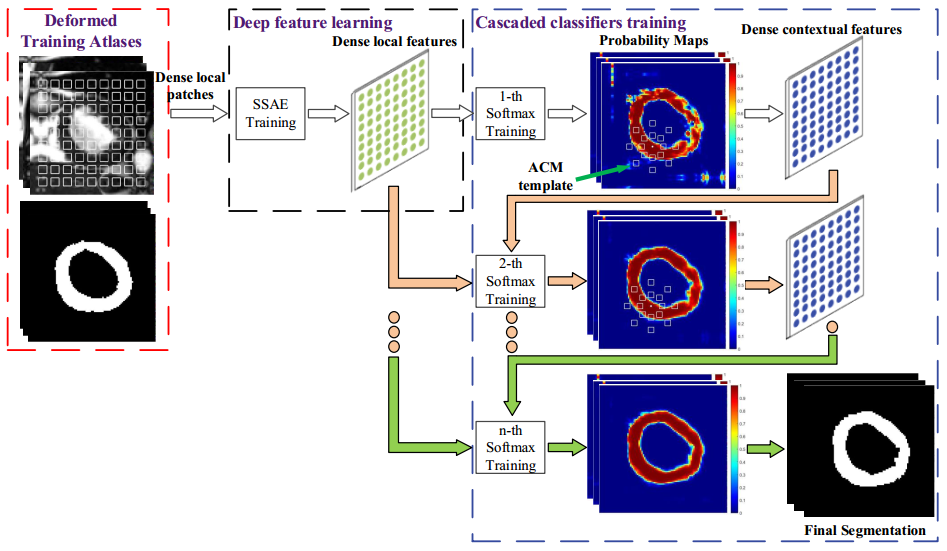

### Model Insight
- **Iteratively Updating Features**. The model employs the iteratively updated context features to fine tune
the results. But the power gradually grow weak as the stage going deeper, that is probability because of the invariant of the probability maps.
- **First Stage Probability Maps**. If the probability maps from the beginning (in the first stage) existing
much mistakes, these mistakes may affect the truthfulness of the context features, so as to affect the whole training and performances of each iterations. So
the segmentation accuracy of the first stage is essential.
- **First Stage Probability Maps**. The authors in [paper](http://pages.ucsd.edu/~ztu/publication/pami_autocontext.pdf) proposed the improved ACM by integrate image
appearance features (such as intensity, mean, variance, gradient and curvature
in a small neighborhood) and texture feature in the ACM model. The maximum
difference between the improved ACM and the ACM is that it is extended with
the addition of several common hand-crafted features (such as gray level cooccurrence matrix, 14 statistics including angular second moment, contrast,
correlation, et al). These hand-crafted features are tedious to constructed, and
it is hard to verify the effectiveness of each single type feature.

### Testing Dataset
The model was primiaryly designed for segmenting myocardium tissues of cardiac MR images that comes from [The Cardiac Atlas Project](http://www.cardiacatlas.org/). To verify the generalization of the proposed model, we applied it to [Weizmann Horses Dataset](http://www.cardiacatlas.org/) segmentation without much modification. The Weizmann Horse Database consists of 328 side-view color images of horses that were also manually segmented, which seems like:

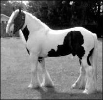 | 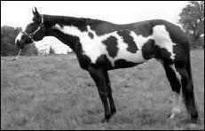 | 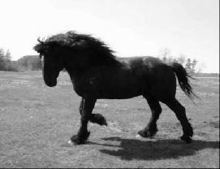

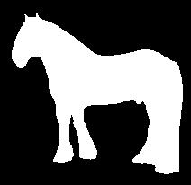 | 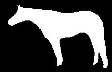 | 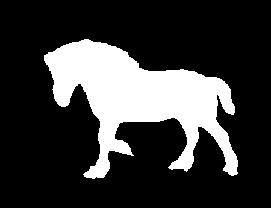
  
### Results
From segmented results below, we can see that:
- The model employs the iteratively updated context features to fine tune
the results. But the power gradually grow weak as the stage going deeper, that
is probability because of the invariant of the probability maps.
- If the probability maps from the beginning (in the first stage) existing
much mistakes, these mistakes may affect the truthfulness of the context features, so as to affect the whole training and performances of each iterations. So
the segmentation accuracy of the first stage is essential

 |  | 

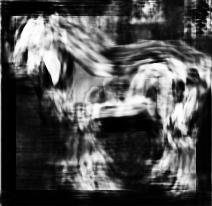 |  | 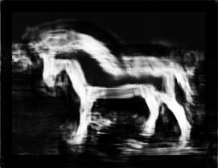

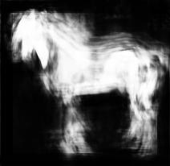 | 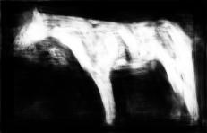 | 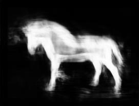

 | 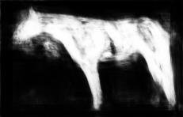 | 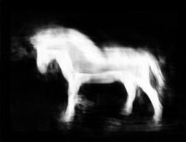

### License
MIT License